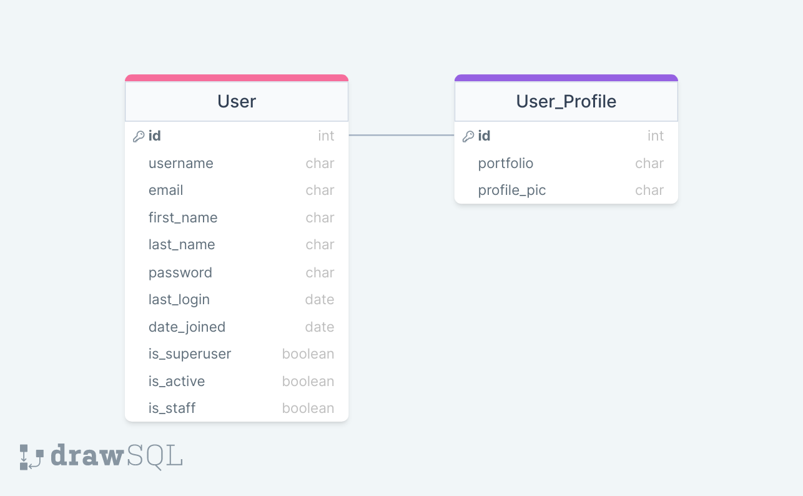
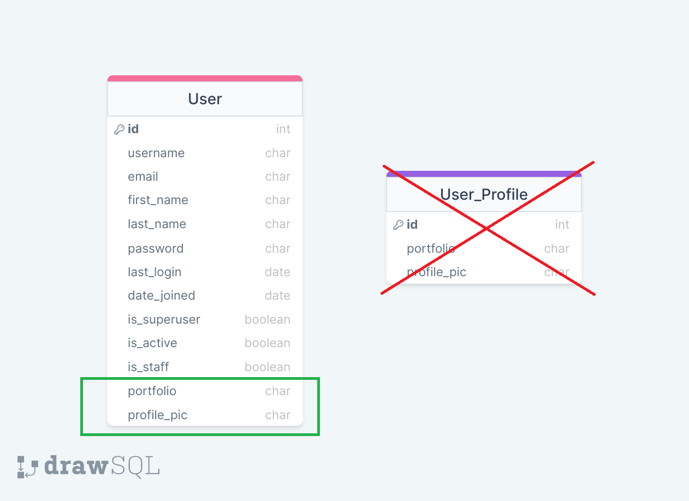

<center></center>
<br>

<center><h1> Django Class Notes</h1></center>
<p>Clarusway</p>
<br>


# Django Auth-2

### Nice to have VSCode Extentions:
- Djaneiro - Django Snippets
- SQLite Viewer

### Needs
- Python, add the path environment variable
- pip
- virtualenv

## Summary
- Extending the existing User model
  - Create project (main)
  - Secure Your Project (Decouple, Gitignore)
  - Create app (users)
  - Create model
  - Using files in models
    - MEDIA_ROOT
    - MEDIA_URL
    - Serving files uploaded by a user during development
  - Logout
  - Register
    - Create forms
    - Create register view
  - Login
  - (Optional) Update
- Substituting a custom User model
- (Optional) Redefining Default User from Scratch by Using AbstractBaseUser


<br>

## Extending the existing User model

There are two ways to extend the default User model without substituting your own model. 

- If the changes you need are purely behavioral, and don’t require any change to what is stored in the database, you can create a proxy model based on User. This allows for any of the features offered by proxy models including default ordering, custom managers, or custom model methods.

- If you wish to *store information* related to User, you can use a *OneToOneField* to a model containing the fields for additional information. This one-to-one model is often called a profile model, as it might store non-auth related information about a site user.



These profile models are not special in any way - they are just Django models that happen to have a one-to-one link with a user model. As such, they aren’t auto created when a user is created, but a django.db.models.signals.post_save could be used to create or update related models as appropriate.

Using related models results in additional queries or joins to retrieve the related data. Depending on your needs, a custom user model that includes the related fields may be your better option, however, existing relations to the default user model within your project’s apps may justify the extra database load.

## Create project

- Create a working directory, name it as you wish, cd to new directory
- Create virtual environment as a best practice:
```py
python3 -m venv env # for Windows or
python -m venv env # for Windows
virtualenv env # for Mac/Linux or;
virtualenv env -p python3 # for Mac/Linux
```
- Activate scripts:
```bash
.\env\Scripts\activate  # for Windows
source env/bin/activate  # for MAC/Linux
```
- See the (env) sign before your command prompt.
- Install django:
```bash
pip install django
```
- See installed packages:
```sh
pip freeze

# you will see:
asgiref==3.3.4
Django==3.2.4
pytz==2021.1
sqlparse==0.4.1

# If you see lots of things here, that means there is a problem with your virtual env activation. 
# Activate scripts again
```
- Create requirements.txt same level with working directory, send your installed packages to this file, requirements file must be up to date:
```py
pip freeze > requirements.txt
```

- Create project:
```py
django-admin startproject project
django-admin startproject project . 
# With . it creates a single project folder.
# Avoiding nested folders
# Alternative naming:
django-admin startproject main . 
```
- Various files has been created!
- Check your project if it's installed correctly:
```py
python3 manage.py runserver  # or,
python manage.py runserver  # or,
py -m manage.py runserver
```

## Secure your project

### .gitignore

Add standard .gitignore file to the project root directory. 

Do that before adding your files to staging area, else you will need extra work to unstage files to be able to ignore them.

### python-decouple

- To use python decouple in this project, first install it:
```py
pip install python-decouple
```

- For more information about [python-decouple](https://pypi.org/project/python-decouple/)

- Import the config object on ```settings.py``` file:
```py
from decouple import config
```

- Create .env file on root directory. We will collect our variables in this file.
```py
SECRET_KEY=o5o9...
```

- Retrieve the configuration parameters in ```settings.py```:
```py
SECRET_KEY = config('SECRET_KEY')
```
- Now you can send you project to the github, but be sure you added a .gitignore file which has .env on it.

- (Optional) If you have nested project folders with the same name; change the name of the project main (parent) directory as src to distinguish from subfolder with the same name!
```bash
# optional
mv .\project\ src
```
- Lets create first application:
- (Optional) Go to the same level with manage.py file:
```bash
# optional
cd .\src\
```

## Create App

```py
python manage.py startapp users

# Alternative naming:
python manage.py startapp home
```

- Go to settings.py and add 'users' app to installed apps:

```python
INSTALLED_APPS = [
    'django.contrib.admin',
    'django.contrib.auth',
    'django.contrib.contenttypes',
    'django.contrib.sessions',
    'django.contrib.messages',
    'django.contrib.staticfiles',

    # my apps
    'users',
]
``` 

- Go to users/views.py and create a view to render home page:

```python
from django.shortcuts import render

def home(request):
    return render(request, 'users/home.html')
```

- Go to main urls.py and include app urls to the list

```python
from django.contrib import admin
from django.urls import path, include

urlpatterns = [
    path('admin/', admin.site.urls),
    path('', include('users.urls')),
]
```

- Create users/urls.py and specify the home url:

```python
from django.urls import path
from .views import home

urlpatterns = [
    path('', home, name='home'),
]
```

- Create home.html:

```html




<h1>Home Page</h1>


<p>Wellcome {{ request.user | title }}!</p>

<p>Wellcome Guest!</p>



```

## Add Bootstrap

- Create users/templates/users folder and create base.html:

```html
<!DOCTYPE html>


<html lang="en">

<head>
  <meta charset="UTF-8" />
  <meta http-equiv="X-UA-Compatible" content="IE=edge" />
  <meta name="viewport" content="width=device-width, initial-scale=1.0" />

  <link rel="stylesheet" href="https://maxcdn.bootstrapcdn.com/bootstrap/4.0.0-alpha.6/css/bootstrap.min.css"
    integrity="sha384-rwoIResjU2yc3z8GV/NPeZWAv56rSmLldC3R/AZzGRnGxQQKnKkoFVhFQhNUwEyJ" crossorigin="anonymous" />

  
  <link rel="stylesheet" href=" " />
  

  <link rel="stylesheet" href="   " />

  <title>Document</title>
</head>

<body>
  

  <div style="margin-top: 100px; margin-bottom: 100px" class="container">

    
    
    
    <div class="alert alert-danger">{{ message }}</div>
    
    <div class="alert alert-{{ message.tags }}">{{ message }}</div>
    
    
    


    
    


  </div>
  
  <script src="https://code.jquery.com/jquery-3.2.1.slim.min.js"
    integrity="sha384-KJ3o2DKtIkvYIK3UENzmM7KCkRr/rE9/Qpg6aAZGJwFDMVNA/GpGFF93hXpG5KkN" crossorigin="anonymous">
  </script>
  <script src="https://cdnjs.cloudflare.com/ajax/libs/popper.js/1.12.9/umd/popper.min.js"
    integrity="sha384-ApNbgh9B+Y1QKtv3Rn7W3mgPxhU9K/ScQsAP7hUibX39j7fakFPskvXusvfa0b4Q" crossorigin="anonymous">
  </script>
  <script src="https://maxcdn.bootstrapcdn.com/bootstrap/4.0.0/js/bootstrap.min.js"
    integrity="sha384-JZR6Spejh4U02d8jOt6vLEHfe/JQGiRRSQQxSfFWpi1MquVdAyjUar5+76PVCmYl" crossorigin="anonymous">
  </script>
  <script src=""></script>
</body>

</html>
```

- Create navbar.html:

```html


<nav class="navbar navbar-toggleable-md navbar-inverse fixed-top bg-inverse">
  <button class="navbar-toggler navbar-toggler-right" type="button" data-toggle="collapse" data-target="#navbarCollapse"
    aria-controls="navbarCollapse" aria-expanded="false" aria-label="Toggle navigation">
    <span class="navbar-toggler-icon"></span>
  </button>
  <a class="navbar-brand" href="">

    Clarusway FS</a>

  <div class="collapse navbar-collapse" id="navbarCollapse">
    <ul class="navbar-nav mr-auto">
      <li class="nav-item active">
          
        <a class="nav-link" href="">Students</a>
      </li>
      <li class="nav-item active">
        <a class="nav-link" href="">Contact</a>
      </li>
    </ul>

    <ul class="navbar-nav ml-auto">

      

      

      <li class="nav-item active">
        <a class="nav-link" href="/admin/">Admin</a>
      </li>
      

      <li class="nav-item active">
          
        <a class="nav-link" href="#">Log Out</a>
      </li>
      

      <li class="nav-item active">
          
        <a class="nav-link" href="#">Log In</a>
      </li>
      

      <li class="nav-item active">
          
        <a class="nav-link" href="#">Register</a>
      </li>

    </ul>
  </div>
</nav>

```

- (Optional) Create static/users folder and add js to close messages after some time in js/timeout.js:
```py
let element = document.querySelector('.alert');

setTimeout(function () {
  element.style.display = 'none';
}, 3000);
```

- (Optional) Add some css in css/style.css:
```css
h1 {
  background-color: bisque;
}
```

## Create a Model Extending User

- Go to users/models.py

```python
from django.db import models
from django.contrib.auth.models import User

# Create your models here.
class UserProfile(models.Model):
    portfolio = models.URLField(blank=True)
    profile_pic = models.ImageField(upload_to = 'profile_pics', blank=True)
    user = models.OneToOneField(User, on_delete=models.CASCADE)

    def __str__(self):
        return self.user.username
```

- Run server and see the error message!

## Using files in models

When you use a FileField or ImageField, Django provides a set of APIs you can use to deal with that file.

Django stores files locally, using the ```MEDIA_ROOT``` and ```MEDIA_URL``` settings.

- **MEDIA_ROOT:**
  - Default: '' (Empty string)
  - Absolute filesystem path to the directory that will hold user-uploaded files.
  - Example: `"/var/www/example.com/media/"`

- **MEDIA_URL:**
  - Default: '' (Empty string)
  - URL that handles the media served from MEDIA_ROOT, used for managing stored files. It must end in a slash if set to a non-empty value. You will need to configure these files to be served in both development and production environments.
  - Example: `"http://media.example.com/"`

<br>

- Specify media paths as a global variable on settings.py:

```py
# Absolute filesystem path to the directory that will hold user-uploaded files
MEDIA_ROOT = BASE_DIR / 'media_folder'

# URL that handles the media served from MEDIA_ROOT
MEDIA_URL = 'media_url/'
```

- Also we need to install pillow (The Python Imaging Library) to add image processing capabilities to our Python interpreter.
```py
pip install Pillow
```

### Serving files uploaded by a user during development

- Also, to see uploaded files/images on our browser we need to add an url pattern to our users/urls.py:
```py
from django.urls import path
from users.views import home

from django.conf.urls.static import static
from django.conf import settings

urlpatterns = [
    path('', home, name='home'),
] + static(settings.MEDIA_URL, document_root=settings.MEDIA_ROOT)
```

- Apply migrations and create a superuser to login admin page.

```bash
py manage.py makemigrations
py manage.py migrate
python manage.py createsuperuser
```

- Register your model to see in admin page. Go to users/admin.py

```python
from django.contrib import admin
from .models import UserProfile

# Register your models here.
admin.site.register(UserProfile)
```

- Login to admin site and create a user profile.

- Run server and see the page!


## Logout

- We need to create view and url. Let us start with view:
```py
from django.contrib.auth import logout
from django.shortcuts import redirect
from django.contrib import messages


# avoid giving the same name with function logout()
def user_logout(request):
    logout(request)
    messages.success(request, 'Logged out!')
    return redirect('home')
```

- Create url:
```py
from .views import user_logout

# avoid giving the same label with built-in logout
path('logout/', user_logout, name='user_logout'),
```

- Activate the link for logout on navbar.


## Register

- To create a register page, we need a form to display. We can use UserCreationForm for User model, and ModelForm for UserProfile.

- Create forms.py under users app.
```py
from django.contrib.auth.forms import UserCreationForm
from django.contrib.auth.models import User

from django.forms import ModelForm
from .models import UserProfile


class UserForm(UserCreationForm):
    class Meta:
        model = User
        fields = ('username', 'email')


class UserProfileForm(ModelForm):
    class Meta:
        model = UserProfile
        # fields = ('profile_pic', 'portfolio')
        exclude = ('user',)
```

- Write correspanding view:
```py
from .forms import UserForm, UserProfileForm

def register(request):
    form_user = UserForm()
    form_profile = UserProfileForm()

    context = {
        'form_user': form_user,
        'form_profile': form_profile,
    }
    return render(request, 'users/register.html', context)
```

- Create users/register.html:
```html
 

 



<h2>Registration Form</h2>



<h3>Thanks for registering</h3>



<h3>Fill out the form please!</h3>

<form action="" method="post" enctype="multipart/form-data">
  
  {{ form_user | crispy }}
  {{ form_profile | crispy }}
  <button type="submit" class="btn btn-danger">Register</button>
</form>



```

- Install [django-crispy-forms](https://django-crispy-forms.readthedocs.io/en/latest/install.html) with the help of documentation.

- Create url:
```py
from .views import register

path('register/', register, name='register'),
```

- Activate the link for register on navbar.

- Complete the view to save user!
```py
def register(request):
    form_user = UserForm()
    form_profile = UserProfileForm()

    if request.method == 'POST':
        form_user = UserForm(request.POST)
        # uploaded files coming from request.FILES
        form_profile = UserProfileForm(request.POST, request.FILES)

        if form_user.is_valid() and form_profile.is_valid():
            # form_user.save()
            # form_profile.save()

            # we need to define user for profile before save
            # how to get the user?
            user = form_user.save()
            profile = form_profile.save(commit=False)
            # get the profile info without saving to db

            profile.user = user
            # now we know the user

            profile.save()

            return redirect('home')

    context = {
        'form_user': form_user,
        'form_profile': form_profile,
    }
    return render(request, 'users/register.html', context)
```

- Do not forget to login and add a message to the register view!
```py
from django.contrib.auth import login

login(request, user)
messages.success(request, 'User Created!')
```

## Login

- For login, we can use AuthenticationForm in our view to make things easier:
```py
from django.contrib.auth.forms import AuthenticationForm


def user_login(request):
    form = AuthenticationForm(request, data=request.POST)

    if form.is_valid():

        # Instead of:
        # username = form.cleaned_data.get('username')
        # password = form.cleaned_data.get('password')
        # user = authenticate(username=username, password=password)
        # AuthenticationForm enables to get those easily with get_user() method
        user = form.get_user()

        if user:
            login(request, user)
            messages.success(request, 'Login Successful!')
            return redirect('home')
    
    return render(request, 'users/user_login.html', {'form': form})
```

- Add url:
```py
from .views import user_login

path('login/', user_login, name='user_login'),
```

- Activate the link for login on navbar.

- Add users/user_login.html:
```html
 

 



<div class="row">
    <div class="col-md-6 offset-md-3">
        <h3>Please Login</h3>

        <form action="" method="post">
             {{form|crispy}}
            <button type="submit" class="btn btn-danger">Login</button>
        </form>
    </div>
</div>

```

## (Optional) Update View

```py
def update_profile(request):
    user = User.objects.get(username=request.user)
    profile = UserProfile.objects.get(user=user)
    form_profile = UserProfileForm(instance=profile) 

    if request.method == 'POST':    
        form_profile = UserProfileForm(request.POST, request.FILES, instance=profile)

        if form_profile.is_valid():
            form_profile.save()  
            messages.success(request,'Update successful')
            return redirect('home')
    context = {
        'form_profile': form_profile,
    }
    return render(request, 'users/update.html', context)
```
- Create correspanding url, template, and link on navbar by yourself!


# Substituting a custom User model

[Documentation](https://docs.djangoproject.com/en/4.1/topics/auth/customizing/#substituting-a-custom-user-model)


Some kinds of projects may have authentication requirements for which Django’s built-in User model is not always appropriate. For instance, on some sites it makes more sense to use an email address as your identification token instead of a username.



Django allows you to override the default user model by providing a value for the AUTH_USER_MODEL setting that references a custom model:

- Go to settings.py and add below line:
```py
AUTH_USER_MODEL = 'users.User'
```
- Don’t forget to point AUTH_USER_MODEL to it. Do this before creating any migrations or running manage.py migrate for the first time.

- Due to limitations of Django’s dynamic dependency feature for swappable models, the model referenced by AUTH_USER_MODEL must be created in the first migration of its app (usually called 0001_initial); otherwise, you’ll have dependency issues.

- **Now, stop server, delete db.sqlite3 and 0001_initial.py under users/migrations to continue the lesson.**

- Go to users/models.py
```py
from django.contrib.auth.models import AbstractUser

# There is a small risk if we name it User
# Can be interfere the default User model
class MyUser(AbstractUser):
    portfolio = models.URLField(blank=True)
    profile_pic = models.ImageField(upload_to='profile_pics', blank=True)
```

- Also, register the model in the app’s admin.py.
```py
from .models import MyUser

admin.site.register(MyUser)
```

- Go to users/forms.py and modify UserForm and comment out UserProfileForm.
```py
from .models import MyUser
from django.contrib.auth.forms import UserCreationForm

class UserForm(UserCreationForm):
    class Meta():
        model = MyUser
        # fields = '__all__'
        fields = ('username', 'email', 'password1', 'password2', 'portfolio', 'profile_pic', 'first_name', 'last_name')
        # exclude = ('is_staff', 'is_active', 'date_joined', 'password', 'last_login', 'is_superuser', 'groups', 'user_permissions', )
```

- Go to users/views.py and modify register view:
```py
from django.shortcuts import render, redirect
from django.contrib.auth import logout, login
from django.contrib import messages
from users.forms import UserForm
from django.contrib.auth.forms import AuthenticationForm


def register(request):
    form = UserForm()

    if request.method == 'POST':
        # pass in post data when instantiate the form.
        form = UserForm(request.POST, request.FILES)
        # if the form is ok with the info filled:
        if form.is_valid():
            user = form.save()
            
            # want user to login right after registered, import login
            login(request, user)
            # want to redirect to home page, import redirect
            return redirect('home')
    context = {
        'form_user': form
    }
    return render(request, "users/register.html", context)
```

- Go to terminal, create db tables, apply them, and create a superuser to login admin panel:
```bash
py manage.py makemigrations
py manage.py migrate
py manage.py createsuperuser
py manage.py runserver
```

- It is also possible to change behaviour of username field and use it for email entries.

- Go to users/models.py

```py
from django.contrib.auth.models import AbstractUser

class User(AbstractUser):
    portfolio = models.URLField(blank=True)
    profile_pic = models.ImageField(upload_to='profile_pics', blank=True)
    
    username = models.EmailField('Email Address', unique=True)
    REQUIRED_FIELDS = []
    # Also delete email field from the form
```
<br>
<br>
<br>
<br>

# (Optional) Redefining Default User from Scratch by Using AbstractBaseUser

- Delete env/ folder
- Delete db.sqlite3
- Delete 0001_initial.py under users/migrations

- Go to users/models.py and replace it with the code below;
```py
from django.db import models
from django.contrib.auth.base_user import BaseUserManager
from django.contrib.auth.models import AbstractBaseUser, PermissionsMixin


class CustomUserManager(BaseUserManager):

    def create_user(self, email, password, **extra_fields):

        if not email:
            raise ValueError('Email is mandatory')
        # if not username:
        #     raise ValueError('Users must have a username')
        email = self.normalize_email(email)
        user = self.model(email=email, **extra_fields)
        user.set_password(password)
        user.save()
        return user

    def create_superuser(self, email, password, **extra_fields):
        # CustomUser.objects.create_superuser(email = 'barry2@clarusway.com', password = '1234', is_superuser = False)

        extra_fields.setdefault('is_staff', True)
        extra_fields.setdefault('is_superuser', True)
        extra_fields.setdefault('is_active', True)

        if extra_fields.get('is_staff') is not True:
            raise ValueError('Superuser must have is_staff=True.')
        if extra_fields.get('is_superuser') is not True:
            raise ValueError('Superuser must have is_superuser=True.')
        return self.create_user(email, password, **extra_fields)


class User(AbstractBaseUser, PermissionsMixin):
    email = models.EmailField('email address', unique=True)
    # username = models.CharField(max_length=30, unique=True)
    is_staff = models.BooleanField(default=False)
    is_active = models.BooleanField(default=True)
    date_joined = models.DateTimeField(auto_now_add=True)
    # is_superuser is defined at PermissionsMixin
    # password and last_login defined at AbstractBaseUser

    USERNAME_FIELD = 'email'
    REQUIRED_FIELDS = []

    objects = CustomUserManager()

    def __str__(self):
        return self.email
```

- Go to admin.py and change it with the code below:
```py
from django.contrib import admin

# Register your models here.
from django.contrib.auth.admin import UserAdmin
from .models import User
from .forms import UserForm, CustomUserChangeForm


class CustomUserAdmin(UserAdmin):
    # add_form = UserForm
    # form = CustomUserChangeForm
    model = User
    list_display = ('email', 'is_staff', 'is_active', 'is_superuser')
    list_filter = ('email', 'is_staff', 'is_active', 'is_superuser')
    fieldsets = (
        (None, {'fields': ('email', 'password')}),
        ('Permissions', {'fields': ('is_staff', 'is_active', 'is_superuser')}),
    )
    add_fieldsets = (
        (None, {
            'classes': ('wide',),
            'fields': ('email', 'password1', 'password2', 'is_staff', 'is_active', 'is_superuser')}
         ),
    )
    search_fields = ('email',)
    ordering = ('email',)


admin.site.register(User, CustomUserAdmin)
# admin.site.register(User)
```

- Go to users/forms.py and change forms:
```py
from .models import User
from django.contrib.auth.forms import UserCreationForm, UserChangeForm


class UserForm(UserCreationForm):

    class Meta():
        model = User
        # fields = '__all__'
        fields = ('email', 'password1', 'password2')
        # exclude = ('is_staff', 'is_active', 'date_joined', 'password', 'last_login', 'is_superuser', 'groups', 'user_permissions', )

class CustomUserChangeForm(UserChangeForm):

    class Meta:
        model = User
        fields = '__all__'
```

- Go to terminal;
```bash
py manage.py makemigrations
py manage.py migrate
py manage.py createsuperuser
py manage.py runserver
```

- Navigate to http://localhost:8000/admin/ and check if everything is ok!


## Next Steps

- Use authentication in your projects.
- Use third party authentication e.g. [django-allauth](https://django-allauth.readthedocs.io/en/latest/installation.html).

<br><br><br>

**<p align="center">&#9786; Happy Coding! &#9997;</p>**

<p>Clarusway</p>
